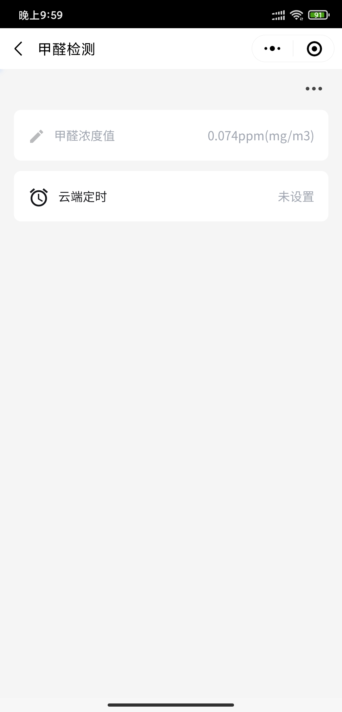

## 0x00. 环境说明

- 软件环境：win10 64位 + MDK
- 开发板：TOS_EVB_G0开发板 x 1
- 传感器：英国 Dart 甲醛传感器 x 1
- 扩展板：E53甲醛传感器底板 x 1
- 下载器：ST-Link下载器 x 1

## 0x01. 安装基础工具（硬件）

#### 连接ST-Link与开发板，严格按照如下方式进行连接否则可能烧坏MCU

开发板3v3---> STlink 3.3V
开发板DIO---> STlink SWDIO
开发板CLK---> STlink SWCLK
开发板GND---> STlink GND

#### 设置跳线帽，切换boot选择端子和串口选择端子

1. 开发版上的ESP固件下载配置切换到GND，使wifi处于下载模式
2. Boot选择切换到0
3. 串口切换端子置于中间，使ESP8266直接与PC串口连接

设置完成后的结果如下图所示：


## 0x02. 安装基础工具（软件）

#### 安装MDK软件

- 激活软件，导入License，注意这部需要以管理员身份运行

- 安装单片机型号中对应的Pack

  可以直接在MDK软件上在线安装，在导航栏打开Pack安装页面，找到STM32G0xx，点击install安装

  

#### 安装ST-Link驱动

前往ST官网即可下载：

https://www.st.com/content/st_com/zh/products/development-tools/software-development-tools/stm32-software-development-tools/stm32-utilities/stsw-link009.html

安装完成后打开设备管理器，查看通用串行总线设备，出现如下所示，则驱动安装成功


#### CH340串口驱动安装

直接通过互联网搜索CH340串口芯片的驱动进行下载安装即可


#### 安装串口调试助手

工具下载：http://www.daxia.com/download/sscom.rar


根据PC和终端之间的连接选择正确的串行端口。

打开设备管理器，在端口列表（如果没有端口选项需要在“查看”中选取“显示隐藏的设备”）中可以看到连接所使用的端口号

~~这里遇到一个非常蠢的问题：STLink和USB需要同时连接到板子上，否则就会出现电脑不识别CH340设备的现象~~


## 0x03. 烧写腾讯云定制固件

#### 下载固件

下载链接：https://github.com/tencentyun/qcloud-iot-esp-wifi 、

使用git下载的命令如下：

```bash
git clone https://github.com/tencentyun/qcloud-iot-esp-wifi.git
```

#### 下载烧写工具

前往乐鑫官网下载Flash下载工具：

https://www.espressif.com/zh-hans/support/download/other-tools

#### 固件说明

腾讯云IoT定制的AT模组固件QCloud_IoT_AT_ESP8266，适用于所有FLASH大小为2MB或者2MB以上的 ESP8266模组。 

AT串口使用UART0，默认的Tx为GPIO1，Rx为GPIO3。但因为ESP8266的UART0 默认会在上电启动期 间输出一些打印，如果打印信息影响设备功能，可在上电期间将 U0TXD(GPIO1)、U0RXD(GPIO3) 分别 与 U0RTS (GPIO15)，U0CTS(GPIO13)进行交换，以屏蔽打印。因此提供两个版本的固件：

- 名称包含UART_1_3的固件串口使用的Tx为GPIO1，Rx为GPIO3。 
- 名称包含UART_15_13的固件串口使用的Tx为GPIO15，Rx为GPIO13。 

进入QCloud_IoT_AT_ESP8266_FW，本文中我们使用第一个固件

#### 烧写固件

##### 运行下载的乐鑫Flash烧写工具

1. 选择Develop Mode

2. 选择ESP8266下载工具

   

   按照上图设置进行配置点击Start后等待下载完成

3. 下载完成

   

   完成后即可关闭工具，**将串口选择端子恢复到默认状态**

## 0x04. 接入腾讯云IoT

### 云端操作

#### 新建项目及产品

项目及产品创建时保留默认选项即可

#### 数据模板

产品界面点击“数据模板”，点击“导入json”，导入如下的json代码

```json
{
  "version": "1.0",
  "profile": {
    "ProductId": "BDDSF87WEA",
    "CategoryId": "1"
  },
  "properties": [
    {
      "id": "ch20_ppm_value",
      "name": "甲醛浓度值",
      "desc": "",
      "mode": "r",
      "define": {
        "type": "float",
        "min": "0",
        "max": "2",
        "start": "0",
        "step": "0.001",
        "unit": "ppm(mg/m3)"
      },
      "required": false
    }
  ],
  "events": [],
  "actions": []
}
```

#### 创建设备

点击“设备调试”，进入后点击“新建设备”，创建成功后进入设备可以看到产品ID、设备名称、设备密钥等相关信息；

### 传感器端操作

进入 < TencentOS-tiny\board\TencentOS_tiny_EVB_G0\KEIL\mqtt_iot_explorer_tc_ch20_oled> 目录，打开TencentOS_tiny.uvprojx工程。

#### 修改Wifi接入信息

编辑`mqtt_iot_explorer_tc_ch20_oled.c`文件，修改`esp8266_tencent_firmware_join_ap`函数中的要接入的WiFi名称和密码


#### 修改云端对接信息

修改文件中的宏定义，对应腾讯云中的配置信息


~~**此处可自行发挥修改程序代码，实现更加复杂有趣的功能**~~

#### 编译下载

编译完成->进入工程配置界面->选择debug选项->选择ST-Link Debugger->点击settings 该页面中的Unit选择ST-Link/V2，Port选择SW，点击确认保存配置；


回到主界面点击下载；

#### 使用串口助手查看日志

打开串口助手后，点击打开串口，点击开发板上的reset按钮，程序开始运行，可在主界面中查看运行日志

WiFi连接成功


接入云平台成功


上述步骤完成后即可回到腾讯云界面查看数据上报情况

## 0x05. 成品展示

- 开发板


- 腾讯云数据展示界面


- 腾讯连连小程序数据展示界面



- 腾讯连连公众号数据报警界面


## 0x06. 后记

感谢 @supowang 大佬提供的极其详细的[教程](http://mk.oa.com/note/817)，本文中大部分内容来自于其所写的教程步骤，另外添加了少部分自己在实践过程中的踩坑记录，后续有时间会尝试接入其他传感器完成更复杂更好玩的实践。
