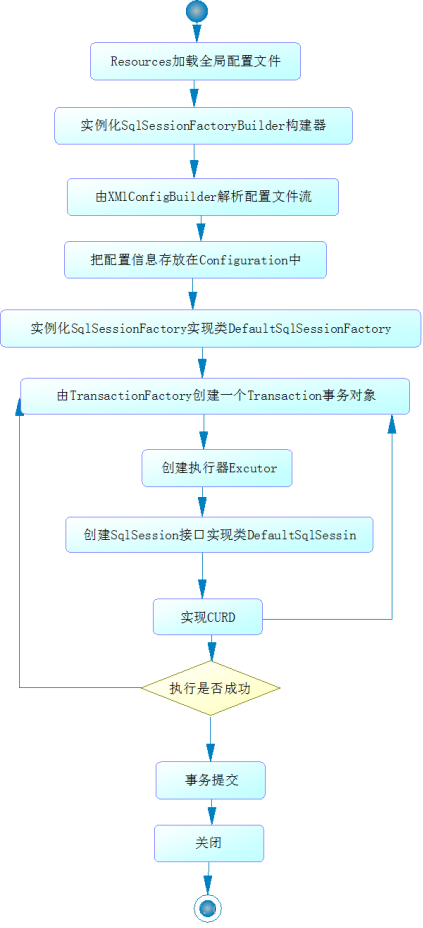
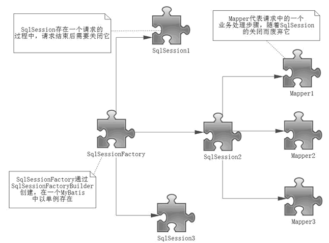
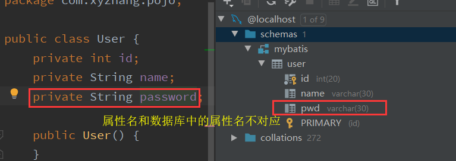
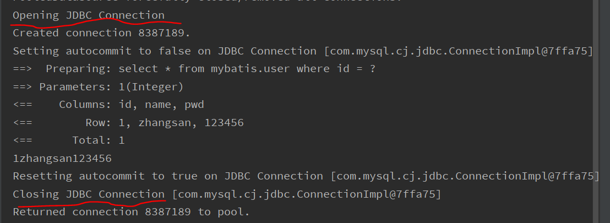
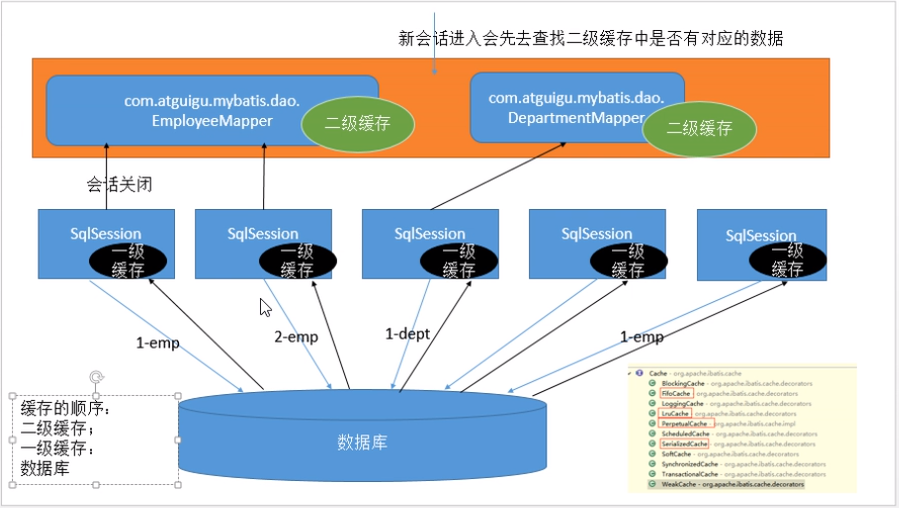

## MyBatis教程

官方教程 https://mybatis.org/mybatis-3/zh/getting-started.html

### 1. 简介

​	MyBatis 是一款优秀的**持久层框架**，它支持定制化 SQL、存储过程以及高级映射。MyBatis 避免了几乎所有的 JDBC 代码和手动设置参数以及获取结果集（RestSet）。MyBatis 可以使用简单的 XML 或注解来配置和映射原生信息，将接口和 Java 的 POJOs(Plain Ordinary Java Object,普通的 Java对象)映射成数据库中的记录。

#### 1.1 持久层

- 完成持久化工作的代码

- 数据持久化：将数据在持久状态与瞬时状态转化的过程。

  使用MyBatis原因：简化JDBC代码，解除sql与程序代码的耦合提高可维护性，支持动态sql

### 2. 使用

#### 2.1 配置文件

```xml
<!--核心配置文件-->
<configuration>
    <environments default="development">
        <!--可以创建多个数据库环境 用environment进行包裹 进行默认选择 此处默认选择development环境-->
        <environment id="development">
            <transactionManager type="JDBC"/>
            <dataSource type="POOLED">
                <!--mysql驱动-->
                <property name="driver" value="com.mysql.cj.jdbc.Driver"/>
                <!--url连接数据库 通过右侧的database选项进行数据库连接-->
                <property name="url" value="jdbc:mysql://localhost:3306/mybatis?useSSL=true&amp;serverTimezone=UTC"/>
                <property name="username" value="root"/>
                <property name="password" value="123456"/>
            </dataSource>
        </environment>
    </environments>
    <mappers>
        <mapper resource="org/mybatis/example/BlogMapper.xml"/>
    </mappers>
</configuration>
```

#### 2.2 从XML中构建SqlSessionFactory获取 SqlSession

> 每个基于 MyBatis 的应用都是以一个 SqlSessionFactory 的实例为核心的。SqlSessionFactory 的实例可以通过 SqlSessionFactoryBuilder 获得。而 SqlSessionFactoryBuilder 则可以从 XML 配置文件或一个预先定制的 Configuration 的实例构建出 SqlSessionFactory 的实例。

从建造者模式的builder创建出factory

获取sqlsessionfactory对象

```java
        try {
            //获取配置文件
            String resource = "org/mybatis/example/mybatis-config.xml";
            InputStream inputStream = Resources.getResourceAsStream(resource);
            //加载流构建工厂
            SqlSessionFactory sqlSessionFactory = new SqlSessionFactoryBuilder().build(inputStream);
        } catch (IOException e) {
            e.printStackTrace();
        }
```

- 获取到SqlSessionFactory对象后，我们就可以从中获取 SqlSession 的实例。SqlSession完全包含了面向数据库执行SQL命令所需的所有方法，通过该实例就可以直接执行已映射的SQL语句。

```java
    public static SqlSession getSqlSession(){
        return sqlSessionFactory.openSession();
    }
```

- 从数据库中获取想要的数据有两种方式：

  - **（推荐使用）**使用正确描述每个语句的参数和返回值的接口（比如 UserDao.class），不仅可以执行清晰和类型安全的代码，而且还不用进行强制类型转换。

    ```java
    UserDao mapper = sqlSession.getMapper(UserDao.class);
    List<User> userList = mapper.getUserList();
    ```

  - ```java
    //需要进行强制类型转换 不推荐
    List<User> userList = sqlSession.selectList("com.xyzhang.dao.UserDao.getUserList");
    ```

#### 2.3 执行流程解析

MyBatis 提供的全部特性都可以利用基于 XML 的映射语言来实现，下文的例子可满足以上对SqlSession的调用

```xml
<?xml version="1.0" encoding="UTF-8" ?>
<!DOCTYPE mapper
        PUBLIC "-//mybatis.org//DTD Mapper 3.0//EN"
        "http://mybatis.org/dtd/mybatis-3-mapper.dtd">
<mapper namespace="com.xyzhang.dao.UserDao">
    <!--select查询语句-->
    <select id="getUserList" resultType="com.xyzhang.pojo.User">
        select * from mybatis.user
    </select>
</mapper>
```

1. 在命名空间“com.xyzhang.dao.UserDao”中定义了一个名为“getUserList”的映射语句，这种命名允许使用指定的完全限定名“com.xyzhang.dao.UserDao.getUserList”来调用映射语句。`List<User> userList = sqlSession.selectList("com.xyzhang.dao.UserDao.getUserList");`

2. 该命名也可以直接映射到在命名空间中同名的 Mapper 类，并将已映射的 select 语句中的名字、参数和返回类型匹配成方法。

   `UserDao mapper = sqlSession.getMapper(UserDao.class);
   List<User> userList = mapper.getUserList();`

   - 第二种方法有很多优势，首先它不依赖于字符串字面值，会更安全一点； 其次，如果你的 IDE 有代码补全功能，那么代码补全可以帮你快速选择已映射的 SQL 语句。



#### 2.4 作用域和生命周期



**SqlSessionFactoryBuilder**：

这个类可以被实例化、使用和丢弃，一旦创建了 SqlSessionFactory，就不再需要它了。 因此 SqlSessionFactoryBuilder 实例的最佳作用域是方法作用域（也就是**局部方法变量**）。 你可以重用 SqlSessionFactoryBuilder 来创建多个 SqlSessionFactory 实例，但是最好还是不要让其一直存在，以保证所有的 XML 解析资源可以被释放给更重要的事情。

**SqlSessionFactory：数据库连接池**

SqlSessionFactory 一旦被创建就应该在应用的运行期间**一直存在**，不应丢弃它或重新创建。 因此 SqlSessionFactory 的最佳作用域是应用作用域（全局变量）。 最简单的实现方式是**使用单例模式或者静态单例模式**。

**SqlSession：数据库连接池的一个请求**

**每个线程都应该有它自己的 SqlSession 实例**。SqlSession 的实例**不是线程安全**的，因此是不能被共享的，所以它的最佳的作用域是请求或方法作用域。 绝对不能将 SqlSession 实例的引用放在一个类的静态域，甚至一个类的实例变量也不行。 也绝不能将 SqlSession 实例的引用放在任何类型的托管作用域中，比如 Servlet 框架中的 HttpSession。

每次收到的 HTTP 请求，就可以打开一个 SqlSession，返回一个响应，就关闭它。

并且应该把关闭操作放到 finally 块中以确保每次都能执行关闭。

**映射器实例：**（mapper）

映射器接口的实例是从 SqlSession 中获得的。因此从技术层面讲，任何映射器实例的最大作用域是和请求它们的 SqlSession 相同的。尽管如此，映射器实例的最佳作用域是方法作用域。 也就是说，映射器实例应该在调用它们的方法中被请求，用过之后即可丢弃。 

最好把映射器放在方法作用域内：

```java
try (SqlSession session = sqlSessionFactory.openSession()) {
  BlogMapper mapper = session.getMapper(BlogMapper.class);
  // 你的应用逻辑代码
}
```

#### 2.5 日后使用方式

只修改接口（UserMapper.java）和配置文件（resource文件下的UserMapper.xml）即可

### 3. XML映射文件及注解

#### 3.0 注解：

1. 简化开发，直接在接口上实现添加注解；

   ```java
   //查询全部用户
   @Select("select id,name,pwd password from user")
   public List<User> getAllUser();
   ```

2. 在核心配置文件上使用class绑定接口（不是配置文件），但可以与配置文件同时使用。

   ```xml
   <!--使用class绑定接口-->
   <mappers>
       <mapper class="com.kuang.mapper.UserMapper"/>
   </mappers>
   ```

实现机制：反射

底层：动态代理

**关于@Param() 注解：**

- 在方法只接受一个参数的情况下，可以不使用@Param。
- 在方法接受多个参数的情况下，建议一定要使用@Param注解给参数命名。
- 如果参数是 对象类型， 则不能使用@Param。
- 不使用@Param注解时，参数只能有一个，并且是Javabean。


#### 3.1 namespace


#### 3.2 select：选择，查询语句

- id：对应namespace中的方法名；
- resultType：Sql语句执行的返回值；
- parameterType：参数类型

📌**增删改需要提交事务sqlSession。commit()；**也可在getSqlsession()时设置为自动提交事务（设置参数为true即可 看**源码！！！**）

```java
    @Test
    public void addUser() {
        //通过实体类获取sqlSession实例
        SqlSession sqlSession = MybatisUtils.getSqlSession();
        //获取映射实例
        UserMapper mapper = sqlSession.getMapper(UserMapper.class);

        mapper.addUser(new User(4,"Num4","147852"));
        //提交事务才能添加成功！！！
        sqlSession.commit();
        sqlSession.close();
    }
```

#### 3.3 Insert

#### 3.4 update

#### 3.5 delete

- 以上操作的通用顺序：

1. 编写接口
2. 编写对应mapper的sql语句
3. 测试

#### 3.6 map传递参数

```java
    //使用map进行数据插入
    int addUser2(Map<String,Object> map);
```

```xml
    <insert id="addUser2" parameterType="map">
        insert into mybatis.user(id, name, pwd) values (#{id},#{name},#{pwd});
    </insert>
```

```java
    //测试使用map增加对象
    @Test
    public void addUser2() {
        SqlSession sqlSession = MybatisUtils.getSqlSession();
        UserMapper mapper = sqlSession.getMapper(UserMapper.class);

        Map<String,Object> map = new HashMap<String, Object>();
        map.put("id",6);
        map.put("name","hello");
        map.put("pwd","159357");

        mapper.addUser2(map);
        sqlSession.commit();
        sqlSession.close();
    }
```


map传递参数，直接在SQL中取出key！【parameterType="map"】

对象传递参数，直接在sql中取对象的属性即可！【parameterType="com.xyzhang.pojo.User"】

只有一个基本类型参数的情况下，可以直接在sql中取到【parameterType可以省略不写】

多个参数用map传递或者使用注解。

#### 3.7 模糊查询

需要注意对查询字符串进行转义：

1. 在sql语句中进行转义（可能会出现sql注入等情况）

```sql
select * from mybatis. user where name like "%" #{value } "%";
```

2. 在传入字符串时进行转义

```java
mapper.getUserLike("%张%");
```


### 4. XML配置字段作用

配置文件中的字段顺序必须遵循以下顺序

- configuration（配置）
  properties（属性）
  settings（设置）
  typeAliases（类型别名）
  typeHandlers（类型处理器）
  objectFactory（对象工厂）
  plugins（插件）
  environments（环境配置）
  environment（环境变量）
  transactionManager（事务管理器）
  dataSource（数据源）
  databaseIdProvider（数据库厂商标识）
  mappers（映射器）

#### 4.1 environments（环境配置）

MyBatis 可以配置成适应多种环境，但每个 SqlSessionFactory 实例只能选择一种环境。

- 为了指定创建哪种环境，只要将它作为可选的参数传递给 SqlSessionFactoryBuilder 即可。

  ```java
  SqlSessionFactory factory = new SqlSessionFactoryBuilder().build(reader, environment);
  SqlSessionFactory factory = new SqlSessionFactoryBuilder().build(reader, environment, properties);
  ```

- 如果忽略了环境参数，那么默认环境将会被加载:

  ```java
  SqlSessionFactory factory = new SqlSessionFactoryBuilder().build(reader);
  SqlSessionFactory factory = new SqlSessionFactoryBuilder().build(reader, properties);
  ```

核心配置文件中需要注意的关键点：

- 默认使用的环境 ID（比如：default="development"）。
- 每个 environment 元素定义的环境 ID（比如：id="development"）。
- 事务管理器的配置（比如：type="JDBC"）。
- 数据源的配置（比如：type="POOLED"）。


**事务管理器：（JDBC/MANAGED）**

📌如果使用Spring框架，不需手动配置会使用自带的管理器

**数据源：（UNPOOLED|POOLED|JNDI）**

POOLED：利用“池”的概念将 JDBC 连接对象组织起来，避免了创建新的连接实例时所必需的初始化和认证时间。 这是一种使得并发 Web 应用快速响应请求的流行处理方式。

**Mybatis默认的事务管理器为JDBC，数据源为POOLED连接池**


#### 4.2 properties（属性）

作用：引用配置文件

这些属性都是可外部配置且可动态替换的，既可以在典型的 Java 属性文件中配置，亦可通过 properties 元素的子元素来传递。

编写外部配置文件

在Mybatis中的配置文件进行引用：

```xml
<properties resource="org/mybatis/example/config.properties">
  <!--可以在引入外部文件的基础上添加属性配置-->
  <!--但当字段重复时，优先使用外部配置文件-->
  <property name="username" value="dev_user"/>
  <property name="password" value="F2Fa3!33TYyg"/>
</properties>
```

#### 4.3 typeAliases（类型别名）

作用：类型别名是为 Java 类型设置一个短的名字。 它只和 XML 配置有关，存在的意义仅在于用来**减少类完全限定名**的冗余

1. 给实体类起别名

```xml
    <typeAliases>
        <typeAlias alias="User" type="com.xyzhang.pojo.User"></typeAlias>
    </typeAliases>
```

2. 给包起别名：在没有注解的情况下，会使用首字母小写的类名来作为它的别名

   例如：com.xyzhang.pojo.User的别名就是user

```xml
    <typeAliases>
        <package name="com.xyzhang.pojo"/>
    </typeAliases>
```

实体类比较少的时候使用第一种方式，否则使用第二种。

第一种方式可以自定义别名，第二种只能跟随类名，但可通过注解方式进行命名更改`@Aliase`。

基本类型的别名在其映射类型的前面添加一个下划线：`_int   int`

包装类型别名就是其映射类型首字母的小写：`int   Integer`

#### 4.4 settings（设置）

| 设置名             |                             描述                             | 默认值 |
| ------------------ | :----------------------------------------------------------: | ------ |
| cacheEnabled       |  全局地开启或关闭配置文件中的所有映射器已经配置的任何缓存。  | true   |
| lazyLoadingEnabled | 延迟加载的全局开关。当开启时，所有关联对象都会延迟加载。 特定关联关系中可通过设置 `fetchType` 属性来覆盖该项的开关状态。 | false  |
| logImpl            |    指定 MyBatis 所用日志的具体实现，未指定时将自动查找。     |        |

#### 4.5 映射器mapper

Mybaits行为配置完成后需要定义SQL映射语句，并告诉MyBatis查找这些语句的路径，可以使用**相对于类路径的资源引用**， 或完全限定资源定位符（包括 `file:///` 的 URL），或类名和包名等

方式一：【推荐使用】

```xml
    <mappers>
        <mapper resource="com.xyzhang.dao/UserMapper.xml"/>
    </mappers>
```

方式二：使用class文件绑定注册

- 接口和Mapper配置文件必须同名且处于同一包下

```xml
<mappers>
  <mapper class="org.mybatis.builder.AuthorMapper"/>
</mappers>
```


方式三：使用扫描包进行注入绑定

- 接口和Mapper配置文件必须同名


#### 4.6 属性名和字段名不一致



运行后发现不一致的属性获取到的值为null

原因：

```xml
类型处理器找不到对应的字段
select * from mybatis.user where id = #{id}
select id,name,pwd from mybatis.user where id = #{id}
```

解决方式：

1. 起别名：

```xml
select id,name,pwd as password from mybatis.user where id = #{id}
```

2. **ResultMap**📌结果集映射

   1. 将返回值类型由resultType更改为resultMap

      ```xml
          <select id="getUserByID" resultMap="UserMap">
              select * from mybatis.user where id = #{id}
          </select>
      ```

   2. 添加结果集映射UserMap设置Type为其对应的类型

      ```xml
          <resultMap id="UserMap" type="User">
              <!--column：数据库中字段 property：实体类中属性-->
              <result column="id" property="id"/>
              <result column="name" property="name"/>
              <result column="pwd" property="password"/>
          </resultMap>
      ```


- `resultMap` 元素是 MyBatis 中最重要最强大的元素。
- ResultMap 的设计思想是，对于简单的语句根本不需要配置显式的结果映射，而对于复杂一点的语句只需要描述它们的关系就行了。

### 5. 日志

#### 5.1 标准实现

种类：

SLF4J | LOG4J【掌握】 | LOG4J2 | JDK_LOGGING | COMMONS_LOGGING | STDOUT_LOGGING 【掌握】| NO_LOGGING

在Mybatis中实现哪个日志，需要在设置中指定

```xml
    <settings>
        <!--标准的日志工厂实现-->
        <setting name="logImpl" value="STDOUT_LOGGING"/>
    </settings>
```




#### 5.2 Log4J

- 可以控制日志信息输送的目的地是[控制台](https://baike.baidu.com/item/控制台/2438626)、文件、[GUI](https://baike.baidu.com/item/GUI)组件，甚至是套接口服务器、[NT](https://baike.baidu.com/item/NT/3443842)的事件记录器、[UNIX](https://baike.baidu.com/item/UNIX) [Syslog](https://baike.baidu.com/item/Syslog)[守护进程](https://baike.baidu.com/item/守护进程/966835)等
- 可以控制每一条日志的输出格式
- 通过定义每一条日志信息的级别，我们能够更加细致地控制日志的生成过程
- 可以通过一个[配置文件](https://baike.baidu.com/item/配置文件/286550)来灵活地进行配置，而不需要修改应用的代码

1. Maven导入Log4J包

2. 在类路径下建立log4j.properties

   ```properties
   ### Log4j配置 ###
   #定义log4j的输出级别和输出目的地（目的地可以自定义名称，和后面的对应）
   #[ level ] , appenderName1 , appenderName2
   log4j.rootLogger=DEBUG,console,file
   #-----------------------------------#
   #1 定义日志输出目的地为控制台
   log4j.appender.console = org.apache.log4j.ConsoleAppender
   log4j.appender.console.Target = System.out
   log4j.appender.console.Threshold=DEBUG
   ####可以灵活地指定日志输出格式，下面一行是指定具体的格式 ###
   #%c: 输出日志信息所属的类目，通常就是所在类的全名
   #%m: 输出代码中指定的消息,产生的日志具体信息
   #%n: 输出一个回车换行符，Windows平台为"/r/n"，Unix平台为"/n"输出日志信息换行
   log4j.appender.console.layout = org.apache.log4j.PatternLayout
   log4j.appender.console.layout.ConversionPattern=[%c]-%m%n
   #-----------------------------------#
   #2 文件大小到达指定尺寸的时候产生一个新的文件
   log4j.appender.file = org.apache.log4j.RollingFileAppender
   #日志文件输出目录
   log4j.appender.file.File=log/info.log
   #定义文件最大大小
   log4j.appender.file.MaxFileSize=10mb
   ###输出日志信息###
   #最低级别
   log4j.appender.file.Threshold=ERROR
   log4j.appender.file.layout=org.apache.log4j.PatternLayout
   log4j.appender.file.layout.ConversionPattern=[%p][%d{yy-MM-dd}][%c]%m%n
   #-----------------------------------#
   #3 druid
   log4j.logger.druid.sql=INFO
   log4j.logger.druid.sql.DataSource=info
   log4j.logger.druid.sql.Connection=info
   log4j.logger.druid.sql.Statement=info
   log4j.logger.druid.sql.ResultSet=info
   #4 mybatis 显示SQL语句部分
   log4j.logger.org.mybatis=DEBUG
   log4j.logger.java.sql=DEBUG
   log4j.logger.java.sql.Statement=DEBUG
   log4j.logger.java.sql.ResultSet=DEBUG
   log4j.logger.java.sql.PreparedStatement=DEBUG
   ```

3. 在核心配置文件的settings字段中，配置log4j为日志工厂的实现


#### 简单使用：

1. 在要使用Log4j的类中引入`import org.apache.log4j.Logger;`

2. 定义日志对象，参数为当前类的class

   `static Logger logger = Logger.getLogger(UserDaoTest.class);`

3. 区分日志级别

   ```java
   logger.info("info:"); logger.debug("debug:");
   logger.error("error:");
   ```

### 6. 分页

#### 6.1 使用limit分页

```sql
SELECT * from user limit startIndex,pageSize
```

#### 6.2 使用Mybatis实现分页

1. 接口

2. Mapper.xml

   ```xml
       <!--分页-->
       <select id="getUserByLimit" parameterType="map" resultMap="userMap">
           select * from mybatis.user limit #{startIndex} , #{pageSize};
       </select>
   ```

   

3. 测试

#### 6.3 使用RowBounds分页【不推荐】


### 7. 一对多和多对一的处理

- 多个学生，对应一个老师
- 对于学生这边而言，**关联**...多个学生，关联一个老师【多对一】
- 对于老师而言，**集合**，一个老师对应很多学生【一对多】

#### 7.1 多对一的处理

多对一环境搭建：

```java
public class Teacher {
    private int id;
    private String name;
}
public class Student {
    private int id;
    private String name;
    //多个学生可以是同一个老师，即多对一
    private Teacher teacher;
}
```


1. 按**查询嵌套**处理

   ```xml
       <!--
       需求：获取所有学生及对应老师的信息
       思路：
           1. 获取所有学生的信息
           2. 根据获取的学生信息的老师ID->获取该老师的信息
           3. 思考问题，这样学生的结果集中应该包含老师，该如何处理呢，数据库中我们一般使用关联查询？
               1. 做一个结果集映射：StudentTeacher
               2. StudentTeacher结果集的类型为 Student
               3. 学生中老师的属性为teacher，对应数据库中为tid。
                  多个 [1,...）学生关联一个老师=> 一对一，一对多
               4. 查看官网找到：association – 一个复杂类型的关联；使用它来处理关联查询
       -->
       <select id="getStudents" resultMap="StudentTeacher">
         select * from student
       </select>
       <resultMap id="StudentTeacher" type="Student">
           <!--association关联属性  property属性名 javaType属性类型 column在多的一方的表中的列名-->
           <association property="teacher"  column="tid" javaType="Teacher" select="getTeacher"/>
       </resultMap>
       <!--
       这里传递过来的id，只有一个属性的时候，下面可以写任何值
       association中column多参数配置：
           column="{key=value,key=value}"
           其实就是键值对的形式，key是传给下个sql的取值名称，value是片段一中sql查询的字段名。
       -->
       <select id="getTeacher" resultType="teacher">
           select * from teacher where id = #{id}
       </select>
   ```

2. 按照查询**结果**嵌套

   ```xml
   <!--
   按查询结果嵌套处理
   思路：
       1. 直接查询出结果，进行结果集的映射
   -->
   <select id="getStudents2" resultMap="StudentTeacher2" >
       select s.id sid, s.name sname , t.name tname
       from student s,teacher t
       where s.tid = t.id
   </select>
   <!--需要对应数据库列名与别名-->
   <resultMap id="StudentTeacher2" type="Student">
       <id property="id" column="sid"/>
       <result property="name" column="sname"/>
       <!--关联对象property 关联对象在Student实体类中的属性-->
       <association property="teacher" javaType="Teacher">
           <result property="name" column="tname"/>
       </association>
   </resultMap>
   ```

#### 7.2 一对多的处理

理解：

- 一个老师拥有多个学生
- 如果对于老师这边，就是一个一对多的现象，即从一个老师下面拥有一群学生（集合）

环境搭建：

```java
public class Student {
    private int id;
    private String name;
    private int tid;
}
public class Teacher {
    private int id;
    private String name;
    //一个老师多个学生
    private List<Student> students;
}
```

1. 按结果嵌套处理

   ```xml
       <!--
       思路:
           1. 从学生表和老师表中查出学生id，学生姓名，老师姓名
           2. 对查询出来的操作做结果集映射
               1. 集合的话，使用collection！
                   JavaType和ofType都是用来指定对象类型的
                   JavaType是用来指定pojo中属性的类型
                   ofType指定的是映射到list集合属性中pojo的类型。
       -->
       <select id="getTeacher" resultMap="TeacherStudent">
           select s.id sid, s.name sname , t.name tname, t.id tid
           from student s,teacher t
           where s.tid = t.id and t.id=#{id}
       </select>
   
       <resultMap id="TeacherStudent" type="Teacher">
           <result  property="name" column="tname"/>
           <collection property="students" ofType="Student">
               <result property="id" column="sid" />
               <result property="name" column="sname" />
               <result property="tid" column="tid" />
           </collection>
       </resultMap>
   ```

2. 按查询嵌套处理

   ```xml
   <select id="getTeacher2" resultMap="TeacherStudent2">
     select * from teacher where id = #{id}
   </select>
   <resultMap id="TeacherStudent2" type="Teacher">
       <!--column是一对多的外键 , 写的是一的主键的列名-->
       <collection property="students" javaType="ArrayList" ofType="Student" column="id" select="getStudentByTeacherId"/>
   </resultMap>
   <select id="getStudentByTeacherId" resultType="Student">
       select * from student where tid = #{id}
   </select>
   ```

#### 7.3 总结

1. 关联-association
2. 集合-collection
3. 所以association是用于一对一和多对一，而collection是用于一对多的关系
4. JavaType和ofType都是用来指定对象类型的
   - JavaType是用来指定pojo中属性的类型
   - ofType指定的是映射到list集合属性中pojo的类型。

### 8. 动态SQL

本质就是拼接sql语句，根据不同的查询条件生成不同sql语句

常用标签：

- if
- choose (when, otherwise)
- trim (where, set)
- foreach

1. 导包

2. 编写配置文件`mybatis-config.xml`

3. 编写实体类(配置文件中有一个设置方法可以将数据库中的命名格式自动转换为驼峰式命名)`<setting name="mapUnderscoreToCamelCase" value="true"/>`

   ```java
   @Data
   public class Blog {
       private String id;
       private String title;
       private String author;
       private Date createTime;
       private int views;
   }
   ```

4. 编写实体类对应的Mapper接口和Mapper.xml

#### 8.1 IF语句

这条语句提供了一种可选的查找文本功能。如果没有传入“title”，那么所有满足“1=1”（所有）的BLOG都会返回；反之若传入了“title”，那么就会对“title”一列进行模糊查找并返回 BLOG 结果

```xml
<!--需求1：
根据作者名字和博客名字来查询博客！
如果作者名字为空，那么只根据博客名字查询，反之，则根据作者名来查询
select * from blog where title = #{title} and author = #{author}
-->
    <select id="queryBlogIF" parameterType="map" resultType="blog">
        select * from mybatis.blog where 1=1
        <if test="title != null">
            and title = #{title}
        </if>
        <if test="author != null">
            and author = #{author}
        </if>
    </select>
```

#### 8.2 trim, where, set

*where* 元素只会在至少有一个子元素的条件返回 SQL 子句的情况下才去插入“WHERE”子句。而且，若语句的开头为“AND”或“OR”，*where* 元素也会将它们去除。(相当于辅助sql语句的生成)

```xml
    <select id="queryBlogIF" parameterType="map" resultType="blog">
        select * from mybatis.blog
        <where>
            <if test="title != null">
                title = #{title}
            </if>
            <if test="author != null">
                and author = #{author}
            </if>
        </where>
    </select>
```

用于动态更新语句(update语句)的解决方案叫做 *set*。*set* 元素可以用于动态包含需要更新的列，而舍去其它的。

若最后一个“if”没有匹配上而前面的匹配上，SQL 语句的最后就会有一个逗号遗留此时set元素就会自动删掉无关的逗号

```xml
    <update id="updateBlog" parameterType="map">
        update mybatis.blog
        <set>
            <if test="title != null">title = #{title},</if>
            <if test="author != null">author = #{author},</if>
            <if test="views != null">views = #{views}</if>
        </set>
        where id = #{id}
    </update>
```

- 以上两种操作都可以使用trim元素来实现，where元素采用*prefixOverrides* 移除前缀值，并且插入 *prefix* 属性中指定的内容，set元素则采用suffixOverrides=","，移除后缀值

  ```xml
  <trim prefix="WHERE" prefixOverrides="AND |OR ">...</trim>
  ```

> 动态SQL本质还是SQL语句，只是在SQL层面执行一个逻辑代码

#### 8.3 choose, when, otherwise

有时我们不想应用到所有的条件语句，而只想从中择其一项。针对这种情况，MyBatis 提供了 choose 元素，它有点像 Java 中的 switch 语句。

```xml
    <select id="queryBlogChoose" parameterType="map" resultType="blog">
        select * from mybatis.blog
        <choose>
            <when test="author != null">
                author = #{author};
            </when>
            <when test="title != null">
                title = #{title};
            </when>
            <otherwise>
                views = #{views};
            </otherwise>
        </choose>
    </select>
```

#### 8.4 SQL片段

相当于定义函数，抽取公共部分，方便复用

```xml
<sql id="if-title-author">
    <if test="title != null">
        title = #{title}
    </if>
    <if test="author != null">
        and author = #{author}
    </if>
</sql>
<!--使用include进行引用-->
<select id="queryBlogIf" parameterType="map" resultType="blog">
    select * from blog
    <where>
        <!-- 引用 sql 片段，如果refid 指定的不在本文件中，那么需要在前面加上 namespace -->
        <include refid="if-title-author"></include>
        <!-- 在这里还可以引用其他的 sql 片段 -->
    </where>
</select>
```

#### 8.5 foreach

*foreach* 元素的功能非常强大，它允许你指定一个集合，声明可以在元素体内使用的集合项（item）和索引（index）变量。它也允许你指定开头与结尾的字符串以及在迭代结果之间放置分隔符。

```xml
<select id="queryBlogForeach" parameterType="map" resultType="blog">
    select * from blog
    <where>
        <!--
		与Java中foreach循环类似
        collection:指定输入对象中的集合属性
        item:每次遍历生成的对象
        open:开始遍历时的拼接字符串
        close:结束时拼接的字符串
        separator:遍历对象之间需要拼接的字符串
        select * from blog where 1=1 and (id=1 or id=2 or id=3)
      -->
        <foreach collection="ids"  item="id" open="and (" close=")" separator="or">
            id=#{id}
        </foreach>
    </where>
</select>
```

### 9. 缓存

#### 9.1 一级缓存

缓存失效的情况：

- 每个sqlSession中的缓存相互独立，不同sqlSession缓存也不互通
- sqlSession相同，查询条件不同
- sqlSession相同，两次查询之间执行了增删改操作
- sqlSession相同，手动清除一级缓存

一级缓存默认开启，只在一个sqlSession中有效，也就是拿到链接到关闭连接的过程

#### 9.2 二级缓存（全局缓存）

- 基于namespace级别的缓存，一个名称空间，对应一个二级缓存；
- 工作机制
  - 一个会话查询一条数据，这个数据就会被放在当前会话的一级缓存中；
  - 如果当前会话关闭了，这个会话对应的一级缓存就没了；但是我们想要的是，会话关闭了，一级缓存中的数据被保存到二级缓存中；
  - 新的会话查询信息，就可以从二级缓存中获取内容；
  - 不同的mapper查出的数据会放在自己对应的缓存（map）中；

使用步骤：

1. 在核心配置文件中开启全局缓存`mybatis-config.xml`

   ```xml
   <setting name="cacheEnabled" value="true"/>
   ```

2. 每个mapper.xml中配置使用二级缓存`xxxMapper.xml`

   ```xml
   <cache
     eviction="FIFO"
     flushInterval="60000"
     size="512"
     readOnly="true"/>
   ```

   这个更高级的配置创建了一个 FIFO 缓存，每隔 60 秒刷新，最多可以存储结果对象或列表的 512 个引用，而且返回的对象被认为是只读的，因此对它们进行修改可能会在不同线程中的调用者产生冲突。

结论：

- 只要开启了二级缓存，我们在同一个Mapper中的查询，可以在二级缓存中拿到数据
- 查出的数据都会被默认先放在一级缓存中
- 只有会话提交或者关闭以后，一级缓存中的数据才会转到二级缓存中

#### 9.3 缓存原理

1. 查询二级缓存中是否存在，存在直接返回
2. 查询一级缓存中是否存在，存在直接返回
3. 查询数据库



