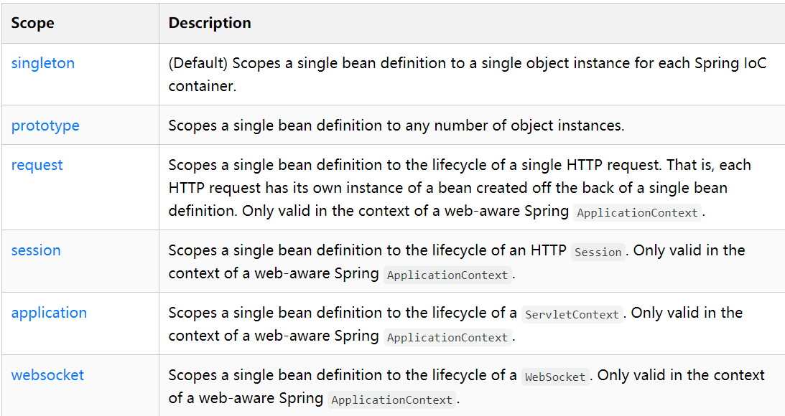
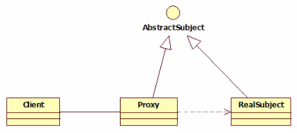

## Spring

#### 1.1、 简介

依赖：Spring Web MVC

```xml
<!-- https://mvnrepository.com/artifact/org.springframework/spring-webmvc -->
<dependency>
    <groupId>org.springframework</groupId>
    <artifactId>spring-webmvc</artifactId>
    <version>5.2.3.RELEASE</version>
</dependency>
<!-- https://mvnrepository.com/artifact/org.springframework/spring-webmvc -->
<dependency>
    <groupId>org.springframework</groupId>
    <artifactId>spring-jdbc</artifactId>
    <version>5.2.3.RELEASE</version>
</dependency>

```

#### 1.2、 优点

- Spring是一个开源免费的框架 , 容器 .
- Spring是一个**轻量级**的框架 , 非侵入式的 .
- **控制反转 IoC , 面向切面 Aop**
- 对事物的支持 , 对框架的支持

#### 1.3、组成


- **核心容器**：核心容器提供 Spring 框架的基本功能。核心容器的主要组件是 `BeanFactory`，它是工厂模式的实现。`BeanFactory` 使用*控制反转*（IOC） 模式将应用程序的配置和依赖性规范与实际的应用程序代码分开。
- **Spring 上下文**：Spring 上下文是一个配置文件，向 Spring 框架提供上下文信息。Spring 上下文包括企业服务，例如 JNDI、EJB、电子邮件、国际化、校验和调度功能。
- **Spring AOP**：通过配置管理特性，Spring AOP 模块直接将面向切面的编程功能 , 集成到了 Spring 框架中。所以，可以很容易地使 Spring 框架管理任何支持 AOP的对象。Spring AOP 模块为基于 Spring 的应用程序中的对象提供了事务管理服务。通过使用 Spring AOP，不用依赖组件，就可以将声明性事务管理集成到应用程序中。
- **Spring DAO**：JDBC DAO 抽象层提供了有意义的异常层次结构，可用该结构来管理异常处理和不同数据库供应商抛出的错误消息。异常层次结构简化了错误处理，并且极大地降低了需要编写的异常代码数量（例如打开和关闭连接）。Spring DAO 的面向 JDBC 的异常遵从通用的 DAO 异常层次结构。
- **Spring ORM**：Spring 框架插入了若干个 ORM 框架，从而提供了 ORM 的对象关系工具，其中包括 JDO、Hibernate 和 iBatis SQL Map。所有这些都遵从 Spring 的通用事务和 DAO 异常层次结构。
- **Spring Web 模块**：Web 上下文模块建立在应用程序上下文模块之上，为基于 Web 的应用程序提供了上下文。所以，Spring 框架支持与 Jakarta Struts 的集成。Web 模块还简化了处理多部分请求以及将请求参数绑定到域对象的工作。
- **Spring MVC 框架**：MVC 框架是一个全功能的构建 Web 应用程序的 MVC 实现。通过策略接口，MVC 框架变成为高度可配置的，MVC 容纳了大量视图技术，其中包括 JSP、Velocity、Tiles、iText 和 POI。

### 2、IOC基础

​	**控制反转IoC(Inversion of Control)，是一种设计思想，DI(依赖注入)是实现IoC的一种方法**。没有IoC的程序中 , 我们使用面向对象编程 , 对象的创建与对象间的依赖关系完全硬编码在程序中，对象的创建由程序自己控制，控制反转后将对象的创建转移给第三方，个人认为所谓控制反转就是：获得依赖对象的方式反转了。

​	**IoC是Spring框架的核心内容**，使用多种方式完美的实现了IoC，可以使用XML配置，也可以使用注解，新版本的Spring也可以零配置实现IoC。

​	Spring容器在初始化时先读取配置文件，根据配置文件或元数据创建与组织对象存入容器中，程序使用时再从Ioc容器中取出需要的对象。


**控制反转是一种通过描述（XML或注解）并通过第三方去生产或获取特定对象的方式。在Spring中实现控制反转的是IoC容器，其实现方法是依赖注入（Dependency Injection,DI）。**

### 3、HelloSpring

#### 3.1、代码编写

Hello实体类：

```java
public class Hello {
    private String name;

    public String getName() {
        return name;
    }
    public void setName(String name) {
        this.name = name;
    }

    public void show(){
        System.out.println("Hello,"+ name );
    }
}
```

编写spring文件，bean.xml

```xml
<?xml version="1.0" encoding="UTF-8"?>
<beans xmlns="http://www.springframework.org/schema/beans"
       xmlns:xsi="http://www.w3.org/2001/XMLSchema-instance"
       xsi:schemaLocation="http://www.springframework.org/schema/beans
        http://www.springframework.org/schema/beans/spring-beans.xsd">

    <!--bean就是java对象 , 由Spring创建和管理
		id = 变量名
		class = new 的对象
		property 相当于给对象中的属性设置一个值 其中的value代表具体的数据类型 ref指在Spring中创建的对象-->
    <bean id="hello" class="com.kuang.pojo.Hello">
        <property name="name" value="Spring"/>
    </bean>

</beans>
```

测试：

```java
@Test
public void test(){
    //解析beans.xml文件 , 生成管理相应的Bean对象
    ApplicationContext context = new ClassPathXmlApplicationContext("beans.xml");
    //getBean : 参数即为spring配置文件中bean的id .
    Hello hello = (Hello) context.getBean("hello");
    hello.show();
}
```

#### 3.2、分析

控制反转：将对象的创建者由程序转换为Spring，程序本身不创建对象，编程被动的接收对象。

依赖注入：本质上采用set方法进行注入，若将实体类中的setter方法注释，bean中会报错

我们实现不同的操作 , 只需在xml配置文件中进行修改 , 不需修改程序，所谓的IoC就是对象由Spring 来创建 , 管理 , 装配 !

### 4、IoC创建对象的方式

#### 4.1、使用无参构造方法创建

bean.xml

```xml
    <bean id="user" class="com.xyzhang.pojo.User">
        <property name="name" value="xyzhang"/>
    </bean>
```

#### 4.2、使用有参构造方法创建

实体类：

```java
public class UserT {

    private String name;

    public UserT(String name) {
        this.name = name;
    }

    public void setName(String name) {
        this.name = name;
    }

    public void show(){
        System.out.println("name="+ name );
    }

}
```

bean.xml：

```xml
<!-- 第一种根据index参数下标设置 -->
<bean id="userT" class="com.xyzhang.pojo.UserT">
    <!-- index指构造方法 , 下标从0开始 -->
    <constructor-arg index="0" value="xyzhang"/>
</bean>
```

```xml
<!-- 第二种直接通过参数名字设置 -->
<bean id="userT" class="com.xyzhang.pojo.UserT">
    <!-- name指参数名 -->
    <constructor-arg name="name" value="xyzhang"/>
</bean>
```

```xml
<!-- 第三种根据参数类型设置 不建议使用（出现两个String类型无法区分） -->
<bean id="userT" class="com.xyzhang.pojo.UserT">
    <constructor-arg type="java.lang.String" value="xyzhang"/>
</bean>
```

📌在配置文件加载时，容器中管理的对象就会进行初始化，无论后续是否使用。

### 5、Spring配置

#### 5.1、别名Alias

设置别名后 在获取Bean时可以使用别名获取（bean中的name可实现相同效果）

`<alias name="userT" alias="userNew"/>`

#### 5.2、Bean配置

```xml
<!--bean就是java对象,由Spring创建和管理-->

<!--
    id 是bean的标识符,要唯一,如果没有配置id,name就是默认标识符
    如果配置id,又配置了name,那么name是别名
    name可以设置多个别名,可以用逗号/分号/空格隔开(相当于Alias)
    如果不配置id和name,可以根据applicationContext.getBean(.class)获取对象;

    class是bean的全限定名=包名+类名
-->
<bean id="hello" name="hello2 h2,h3;h4" class="com.xyzhang.pojo.Hello">
    <property name="name" value="Spring"/>
</bean>
```

#### 5.3、import

可以将多个配置文件导入合并为一个(适用于团队合作)

`<import resource="{path}/beans.xml"/>`

### 6、依赖注入DI

- 依赖 : 指Bean对象的创建依赖于容器 . Bean对象的依赖资源 .
- 注入 : 指Bean对象所依赖的资源属性 , 由容器来设置和装配 .

#### 6.1、构造器注入

#### 6.2、set方式注入【重点】

要求被注入的属性 , 必须要有setter

实体类：

Address.java

```java
public class Address {

    private String address;

    public String getAddress() {
        return address;
    }

    public void setAddress(String address) {
        this.address = address;
    }
}
```

Student.java

```java
public class Student {

    private String name;
    private Address address;
    private String[] books;
    private List<String> hobbys;
    private Map<String,String> card;
    private Set<String> games;
    private String wife;
    private Properties info;

    public void setName(String name) {
        this.name = name;
    }

    public void setAddress(Address address) {
        this.address = address;
    }

    public void setBooks(String[] books) {
        this.books = books;
    }

    public void setHobbys(List<String> hobbys) {
        this.hobbys = hobbys;
    }

    public void setCard(Map<String, String> card) {
        this.card = card;
    }

    public void setGames(Set<String> games) {
        this.games = games;
    }

    public void setWife(String wife) {
        this.wife = wife;
    }

    public void setInfo(Properties info) {
        this.info = info;
    }

    public void show(){
        System.out.println("name="+ name
                + ",address="+ address.getAddress()
                + ",books="
        );
        for (String book:books){
            System.out.print("<<"+book+">>\t");
        }
        System.out.println("\n爱好:"+hobbys);

        System.out.println("card:"+card);

        System.out.println("games:"+games);

        System.out.println("wife:"+wife);

        System.out.println("info:"+info);

    }
}
```

- 常量注入

```xml
<bean id="student" class="com.xyzhang.pojo.Student">
    <property name="name" value="小明"/>
</bean>
```

- Bean注入（引用类型注入）

先在容器中创建出引用类型，通过ref在需要处引用

```xml
<bean id="addr" class="com.xyzhang.pojo.Address">
    <property name="address" value="西大直街92号"/>
</bean>

<bean id="student" class="com.xyzhang.pojo.Student">
    <property name="name" value="小明"/>
    <property name="address" ref="addr"/>
</bean>
```

- 数组注入

```xml
    <property name="books">
        <array>
            <value>西游记</value>
            <value>红楼梦</value>
            <value>水浒传</value>
        </array>
    </property>
```

- 集合list注入

```xml
<property name="hobbys">
    <list>
        <value>听歌</value>
        <value>看电影</value>
        <value>爬山</value>
    </list>
</property>
```

- Map注入(采用key value键值对进行注入)

```xml
<property name="card">
    <map>
        <entry key="中国邮政" value="456456456465456"/>
        <entry key="建设" value="1456682255511"/>
    </map>
</property>
```

- 集合set注入

```xml
<property name="games">
    <set>
        <value>LOL</value>
        <value>BOB</value>
        <value>COC</value>
    </set>
</property>
```

- null注入

`<property name="wife"><null/></property>`

- properties注入

```xml
<property name="info">
    <props>
        <prop key="学号">20190604</prop>
        <prop key="性别">男</prop>
        <prop key="姓名">小明</prop>
    </props>
</property>
```

#### 6.3、拓展方式注入

以下两种不能直接使用，需要导入xml头文件

1. P命名空间注入（不需使用构造器，默认无参构造器即可）：📌需要在头文件中加入约束条件

   ```xml
   导入约束 : xmlns:p="http://www.springframework.org/schema/p"
   
   <!--P(属性: properties)命名空间 , 属性依然要设置set方法-->
   <bean id="user" class="com.xyzhang.pojo.User" p:name="xyzhang" p:age="18"/>
   ```

2. C命名空间注入（使用实体类中的**有参构造器**注入）：📌需要在头文件中加入约束条件

   ```xml
   导入约束 : xmlns:c="http://www.springframework.org/schema/c"
   <!--C(构造: Constructor)命名空间 , 属性依然要设置set方法-->
   <bean id="user" class="com.xyzhang.pojo.User" c:name="xyzhang" c:age="18"/>
   ```

#### 6.4、Bean的作用域



​	后四种作用域仅在基于web的应用中使用（不必关心你所采用的是什么web应用框架），只能用在基于web的Spring ApplicationContext环境。

1. Singleton单例模式（Spring默认模式）

   Spring IoC容器中只会存在一个共享的bean实例，并且所有对bean的请求，只要id与该bean定义相匹配，则只会返回bean的同一实例。Singleton是单例类型，就是在创建起容器时就同时自动创建了一个bean的对象，不管你是否使用，他都存在了，每次获取到的对象都是同一个对象。

   `<bean id="accountService" class="com.something.DefaultAccountService" scope="singleton"/>`

2. Prototype原型模式

   Prototype作用域的bean会导致在每次对该bean请求（将其注入到另一个bean中，或者以程序的方式调用容器的getBean()方法）时都会创建一个新的bean实例。Prototype是原型类型，它在我们创建容器的时候并没有实例化，而是当我们获取bean的时候才会去创建一个对象，而且我们每次获取到的对象都不是同一个对象。

   `<bean id="accountService" class="com.something.DefaultAccountService" scope="prototype"/>`

3. Request

4. Session

5. application

### 7、Bean自动装配

#### 7.1、配置方式：

1. 在xml中显示配置；
2. 在Java中显示配置；
3. 隐式的bean发现机制和自动装配；

#### 7.2、Spring的自动装配：

1. 组件扫描(component scanning)：spring会自动发现应用上下文中所创建的bean；
2. 自动装配(autowiring)：spring自动满足bean之间的依赖，也就是我们说的IoC/DI；

- byName 按名称自动装配

  修改bean的配置增加属性autowire=“byName”

  ```xml
  <bean id="user" class="com.xyzhang.pojo.User" autowire="byName">
      <property name="str" value="xyzhang"/>
  </bean>
  ```

  当bean节点设置该属性后

  1. 将查找其类中所有的set方法名，例如setCat，获得将set去掉并且首字母小写的字符串，即cat。
  2. 在spring容器中寻找是否有此字符串名称id的对象。
  3. 如果有，就取出注入；如果没有，就报空指针异常。

- byType 按类型自动装配

  👓使用前需要保证，同一type的对象在spring容器中**唯一**，否则会报异常。

  ```xml
  <bean id="user" class="com.xyzhang.pojo.User" autowire="byType">
      <property name="str" value="xyzhang"/>
  </bean>
  ```

#### 7.3、使用注解实现自动装配

##### 7.3.1、准备工作

1. 添加注解所需的配置文件，在Spring配置文件中引入context文件头
2. 开启属性注解支持

```xml
<?xml version="1.0" encoding="UTF-8"?>
<beans xmlns="http://www.springframework.org/schema/beans"
    xmlns:xsi="http://www.w3.org/2001/XMLSchema-instance"
    xmlns:context="http://www.springframework.org/schema/context"
    xsi:schemaLocation="http://www.springframework.org/schema/beans
        https://www.springframework.org/schema/beans/spring-beans.xsd
        http://www.springframework.org/schema/context
        https://www.springframework.org/schema/context/spring-context.xsd">
	<!--开启属性注解支持-->
    <context:annotation-config/>

</beans>
```

##### 7.3.2、@Autowired【最常用】

可直接在属性上使用，也可在set方法上直接使用！

使用@Autowired注解可以不用编写setter方法，前提是自动装配的属性在IoC容器中存在，且符合名字byName！

实体类：

```java
public class User {
    @Autowired
    private Cat cat;
    @Autowired
    private Dog dog;
    private String str;

    public Cat getCat() {
        return cat;
    }
    public Dog getDog() {
        return dog;
    }
    public String getStr() {
        return str;
    }
}
```

配置文件bean.xml

```xml
<bean id="dog" class="com.xyzhang.pojo.Dog"/>
<bean id="cat" class="com.xyzhang.pojo.Cat"/>
<bean id="user" class="com.xyzhang.pojo.User"/>
```

其中：@Autowired(required=false)  required=false表示对象可以为null；true，对象不能为null。默认为true

##### 7.3.3、@Qualifier

- @Autowired 是根据类型自动装配的，加上@Qualifier则可以根据byName的方式自动装配
- @Qualifier不能单独使用。

使用方法：

实体类：

```java
@Autowired
@Qualifier(value = "cat1")
private Cat cat;
@Autowired
@Qualifier(value = "dog1")
private Dog dog;
```

bean.xml

```xml
<bean id="dog1" class="com.kuang.pojo.Dog"/>
<bean id="cat1" class="com.kuang.pojo.Cat"/>
```

##### 7.3.4、@Resource

- @Resource如有指定的name属性，先按该属性进行byName方式查找装配；
- 其次再进行默认的byName方式进行装配；
- 如果以上都不成功，则按byType的方式自动装配。
- 都不成功，则报异常。

@Resource与@Autowired区别：

1. 都可以用来装配Bean，都可以写在字段上，或写在setter方法上。
2. @Autowired  通过byType方式实现，默认情况下必须要求依赖对象必须存在，否则需要指定required=false；
3. @Resource 默认通过byName实现，若找不到名字则通过byType实现。

### 8、使用注解开发

##### 8.1、Bean实现【@Component（'...'）】

1. 配置扫描哪些包下的注解

   ```xml
   <!--指定注解扫描包-->
   <context:component-scan base-package="com.xyzhang.pojo"/>
   ```

2. 在指定包下编写类，添加注解

   ```java
   @Component("user")
   // 相当于配置文件中 <bean id="user" class="当前注解的类"/>
   public class User {
       public String name = "xyzhang";
   }
   ```

3. 测试

   ```java
   @Test
   public void test(){
       ApplicationContext applicationContext =
           new ClassPathXmlApplicationContext("beans.xml");
       User user = (User) applicationContext.getBean("user");
       System.out.println(user.name);
   }
   ```

##### 8.2、属性注入【@Value('xxx')】

1. 可以不使用setter方法，直接在属性名上添加 @Value('xxx')

   ```java
   @Component("user")
   // 相当于配置文件中 <bean id="user" class="当前注解的类"/>
   public class User {
       @Value("xyzhang")
       // 相当于配置文件中 <property name="name" value="xyzhang"/>
       public String name;
   }
   ```

2. 若提供了setter方法，可以直接在set方法上添加@Value('xxx')

   ```java
   @Component("user")
   public class User {
   
       public String name;
   
       @Value("xyzhang")
       public void setName(String name) {
           this.name = name;
       }
   }
   ```

##### 8.3、衍生注解

**@Component三个衍生注解**，在web开发中按照mvc三层架构分层，这四个注解功能完全相同。

- @Controller：web层
- @Service：service层
- @Repository：dao层

##### 8.4、自动装配注解

- @Autowired
- @Qualifier

- @Resource

##### 8.5、作用域【@Scope('...')】

作用域中可选singleton，prototype...

```java
//该例相当于实现了整个Bean的功能
@Controller("user")
@Scope("prototype")
public class User {
    @Value("xyzhang")
    public String name;
}
```

##### 8.6、总结

**XML与注解比较**

- XML可以适用任何场景 ，结构清晰，维护方便
- 注解不是自己提供的类使用不了，开发简单方便

**xml与注解整合开发：**【最佳实践】

- xml管理Bean
- 注解完成属性注入


1. 开启注解指令支持，使注解生效。
2. 指定要扫描的包 

```xml
<context:component-scan base-package="com.xyzhang.pojo"/>
<context:annotation-config/>
```

### 9、基于Java类进行配置

实体类：

```java
@Component  //将这个类标注为Spring的一个组件，放到容器中！
public class Dog {
    public String name = "dog";
}
```

新建config配置文件

```java
//代表这是一个配置类 该类也会被注册到容器中 因为本身就是一个@Component
//相当于bean.xml
@Configuration
public class MyConfig {

    @Bean //通过方法注册一个bean，这里的返回值就Bean的类型，方法名就是bean的id！返回值相当于bean中的class
    public Dog dog(){
        //返回要注入到bean的对象
        return new Dog();
    }
}
```

测试类

```java
@Test
public void test2(){
    ApplicationContext applicationContext =
            new AnnotationConfigApplicationContext(MyConfig.class);
    Dog dog = (Dog) applicationContext.getBean("dog");
    System.out.println(dog.name);
}
```

### 10、AOP

#### 10.1、代理模式

- 静态代理
- 动态代理



##### 10.1.1、静态代理

角色分析：

- 抽象角色 : 一般使用接口或者抽象类来实现
- 真实角色 : 被代理的角色
- 代理角色 : 代理真实角色 ; 代理真实角色后 , 一般会做一些附属的操作 .
- 客户 : 使用代理角色来进行一些操作 .

---

静态代理举例：“中介租房”

1. Rent 抽象角色

```java
//抽象角色：租房
public interface Rent {
    public void rent();
}
```

2. Host 真实角色

```java
//真实角色: 房东，房东要出租房子
public class Host implements Rent{
    public void rent() {
        System.out.println("房屋出租");
    }
}
```

3. Proxy 代理角色

```java
//代理角色：中介
public class Proxy implements Rent {

    private Host host;
    public Proxy() { }
    public Proxy(Host host) {
        this.host = host;
    }

    //租房 代理角色一般会有一些附属操作！
    public void rent(){
        seeHouse();
        host.rent();
        fare();
    }
    //看房
    public void seeHouse(){
        System.out.println("带房客看房");
    }
    //收中介费
    public void fare(){
        System.out.println("收中介费");
    }
}
```

4. Client 客户

```java
//客户类，一般客户都会去找代理！
public class Client {
    public static void main(String[] args) {
        //房东要租房
        Host host = new Host();
        //中介帮助房东
        Proxy proxy = new Proxy(host);
        //你去找中介！
        proxy.rent();
    }
}
```

---

**静态代理的好处：**

- 可以使得我们的真实角色更加纯粹 . 不再去关注一些公共的事情 .
- 公共的业务由代理来完成 . 实现了业务的分工 ,
- 公共业务发生扩展时变得更加集中和方便 .

缺点：

- 类多了 , 多了代理类 , 工作量变大了 . 开发效率降低 .


##### 10.1.2、动态代理

- 动态代理的角色和静态代理的一样 .
- 动态代理的代理类是动态生成的 . 静态代理的代理类是我们提前写好的
- 动态代理分为两类 : 一类是基于接口动态代理 , 一类是基于类的动态代理
  - 基于接口的动态代理----JDK动态代理
  - 基于类的动态代理--cglib
  - 现在用的比较多的是 javasist 来生成动态代理 .

JDK的动态代理需要了解两个类：

核心 : InvocationHandler 调用处理程序， Proxy 代理


**代码实现：**

Rent.java 抽象角色

```java
//抽象角色：租房
public interface Rent {
    public void rent();
}
```

Host.java 

```java
//真实角色: 房东，房东要出租房子
public class Host implements Rent{
    public void rent() {
        System.out.println("房屋出租");
    }
}
```

ProxyInvocationHandler.java 

```java
public class ProxyInvocationHandler implements InvocationHandler {
    private Rent rent;

    public void setRent(Rent rent) {
        this.rent = rent;
    }

    //生成代理类，重点是第二个参数，获取要代理的抽象角色！之前都是一个角色，现在可以代理一类角色
    public Object getProxy(){
        return Proxy.newProxyInstance(this.getClass().getClassLoader(),
                rent.getClass().getInterfaces(),this);
    }

    // proxy : 代理类 method : 代理类的调用处理程序的方法对象.
    // 处理代理实例上的方法调用并返回结果
    @Override
    public Object invoke(Object proxy, Method method, Object[] args) throws Throwable {
        seeHouse();
        //核心：本质利用反射实现！
        Object result = method.invoke(rent, args);
        fare();
        return result;
    }

    //看房
    public void seeHouse(){
        System.out.println("带房客看房");
    }
    //收中介费
    public void fare(){
        System.out.println("收中介费");
    }
}
```

Client.java

```java
//租客
public class Client {

    public static void main(String[] args) {
        //真实角色
        Host host = new Host();
        //代理实例的调用处理程序
        ProxyInvocationHandler pih = new ProxyInvocationHandler();
        pih.setRent(host); //将真实角色放置进去！
        Rent proxy = (Rent)pih.getProxy(); //动态生成对应的代理类！
        proxy.rent();
    }
}
```

核心：**一个动态代理 , 一般代理某一类业务 , 一个动态代理可以代理多个类，代理的是接口！**


**动态代理的好处：**

- 可以使得我们的真实角色更加纯粹 . 不再去关注一些公共的事情 .
- 公共的业务由代理来完成 . 实现了业务的分工 ,
- 公共业务发生扩展时变得更加集中和方便 .
- 一个动态代理 , 一般代理某一类业务
- 一个动态代理可以代理多个类，代理的是接口！

#### 10.2、AOP

##### 10.2.1、作用【从纵向开发到横向开发】

##### 10.2.2、使用Spring实现AOP

使用AOP织入，需要导入依赖包

```xml
<dependency>
    <groupId>org.aspectj</groupId>
    <artifactId>aspectjweaver</artifactId>
    <version>1.9.4</version>
</dependency>
```


1. 通过SpringAPI实现【SpringAPI接口实现】

   - 业务接口和实体类：

   ```java
   public interface UserService {
       public void add();
       public void delete();
       public void update();
       public void search();
   }
   public class UserServiceImpl implements UserService{
       @Override
       public void add() {
           System.out.println("增加用户");
       }
       @Override
       public void delete() {
           System.out.println("删除用户");
       }
       @Override
       public void update() {
           System.out.println("更新用户");
       }
       @Override
       public void search() {
           System.out.println("查询用户");
       }
   }
   ```

   - 增强类：

   ```java
   public class Log implements MethodBeforeAdvice {
   
       //method : 要执行的目标对象的方法
       //objects : 被调用的方法的参数
       //Object : 目标对象
       @Override
       public void before(Method method, Object[] objects, Object o) throws Throwable {
           System.out.println( o.getClass().getName() + "的" + method.getName() + "方法被执行了");
       }
   }
   public class AfterLog implements AfterReturningAdvice {
       //returnValue 返回值
       //method被调用的方法
       //args 被调用的方法的对象的参数
       //target 被调用的目标对象
       @Override
       public void afterReturning(Object returnValue, Method method, Object[] args, Object target) throws Throwable {
           System.out.println("执行了" + target.getClass().getName()
           +"的"+method.getName()+"方法,"
           +"返回值："+returnValue);
       }
   }
   ```

   - 在Bean文件中进行注册，实现AOP切入实现。

   ```xml
   <?xml version="1.0" encoding="UTF-8"?>
   <beans xmlns="http://www.springframework.org/schema/beans"
          xmlns:xsi="http://www.w3.org/2001/XMLSchema-instance"
          xmlns:aop="http://www.springframework.org/schema/aop"
          xsi:schemaLocation="http://www.springframework.org/schema/beans
           http://www.springframework.org/schema/beans/spring-beans.xsd
           http://www.springframework.org/schema/aop
           http://www.springframework.org/schema/aop/spring-aop.xsd">
   
       <!--注册bean-->
       <bean id="userService" class="com.xyzhang.service.UserServiceImpl"/>
       <bean id="log" class="com.xyzhang.log.Log"/>
       <bean id="afterLog" class="com.xyzhang.log.AfterLog"/>
   
       <!--aop的配置-->
       <aop:config>
           <!--切入点  expression:表达式匹配要执行的方法-->
           <aop:pointcut id="pointcut" expression="execution(* com.xyzhang.service.UserServiceImpl.*(..))"/>
           <!--执行环绕; advice-ref执行方法 . pointcut-ref切入点-->
           <aop:advisor advice-ref="log" pointcut-ref="pointcut"/>
           <aop:advisor advice-ref="afterLog" pointcut-ref="pointcut"/>
       </aop:config>
   
   </beans>
   ```

   📌**pointcut切入点表达式含义：**

   execution (* com.sample.service.impl..\*.\* (..))包含五个部分：

   1、execution(): 表达式主体。

   2、第一个 * 号：表示返回类型，* 号表示所有的类型。

   3、包名：表示需要拦截的包名，后面的两个句点表示当前包和当前包的所有子包，com.sample.service.impl包、子孙包下所有类的方法。

   4、第二个 * 号：表示类名，* 号表示所有的类。

   5、 * (..):最后这个星号表示方法名，*号表示所有的方法，后面括弧里面表示方法的参数，两个句点表示任何参数。

   - 测试

   ```java
   public class MyTest {
       @Test
       public void test(){
           ApplicationContext context = new ClassPathXmlApplicationContext("beans.xml");
           UserService userService = (UserService) context.getBean("userService");
           userService.search();
       }
   }
   ```

   **本质：动态代理**

2. 自定义类来实现Aop【切面定义】

   - 业务类不变

   - 切入类：

   ```java
   public class DiyPointcut {
   
       public void before(){
           System.out.println("---------方法执行前---------");
       }
       public void after(){
           System.out.println("---------方法执行后---------");
       }
   }
   ```

   - 配置文件

   ```xml
   <!--第二种方式自定义实现-->
   <!--注册bean-->
   <bean id="diy" class="com.xyzhang.config.DiyPointcut"/>
   
   <!--aop的配置-->
   <aop:config>
       <!--第二种方式：使用AOP的标签实现-->
       <aop:aspect ref="diy">
           <aop:pointcut id="diyPonitcut" expression="execution(* com.kuang.service.UserServiceImpl.*(..))"/>
           <aop:before pointcut-ref="diyPonitcut" method="before"/>
           <aop:after pointcut-ref="diyPonitcut" method="after"/>
       </aop:aspect>
   </aop:config>
   ```

   - 测试：

   ```java
   public class MyTest {
       @Test
       public void test(){
           ApplicationContext context = new ClassPathXmlApplicationContext("beans.xml");
           UserService userService = (UserService) context.getBean("userService");
           userService.add();
       }
   }
   ```

3. 使用注解实现

   - 编写注解实现的增强类

   ```java
   @Aspect
   public class AnnotationPointcut {
       @Before("execution(* com.kuang.service.UserServiceImpl.*(..))")
       public void before(){
           System.out.println("---------方法执行前---------");
       }
   
       @After("execution(* com.kuang.service.UserServiceImpl.*(..))")
       public void after(){
           System.out.println("---------方法执行后---------");
       }
   
       @Around("execution(* com.kuang.service.UserServiceImpl.*(..))")
       public void around(ProceedingJoinPoint jp) throws Throwable {
           System.out.println("环绕前");
           System.out.println("签名:"+jp.getSignature());
           //执行目标方法proceed
           Object proceed = jp.proceed();
           System.out.println("环绕后");
           System.out.println(proceed);
       }
   }
   ```

   - bean.xml注册bean，增加支持注解的配置

   ```xml
   <!--第三种方式:注解实现-->
   <bean id="annotationPointcut" class="com.xyzhang.config.AnnotationPointcut"/>
   <aop:aspectj-autoproxy/>
   ```


### 11、整合Mybatis

[mybatis-spring](http://mybatis.org/spring/zh/index.html)

核心要点：Spring管理对象


#### 11.1、方式一

1. 编写DataSource
2. 创建SqlSessionFactory注入DataSource（绑定mybatis配置文件）
3. 创建SqlSessionTemplate【mybatis-spring的核心完全替代sqlSession】通过构造方法传入SqlSessionFactory
4. 给接口添加实现类UserMapperImpl通过配置文件注入SqlSessionTemplate
5. 将实现类注入到Spring中


#### 11.2、方式二 SqlSessionDaoSupport


### 12、声明式事务

#### 12.1、事务

- 把一系列动作当成一个独立的工作单元，要么都成功，要么都失败。
- 用于确保数据的完整性和一致性。

四个属性（ACID原则）：

1. 原子性
2. 一致性
3. 隔离性：多个事务可能处理相同数据，防止数据损坏。
4. 持久性：事务一旦提交，结果都不会再被影响，被持久化的写到存储器中。

#### 12.2、  spring中的事务管理

- 声明式事务：AOP

1. 配置声明式事务

   ```xml
   <bean id="transactionManager" class="org.springframework.jdbc.datasource.DataSourceTransactionManager">
           <property name="dataSource" ref="dataSource" />
    </bean>
   ```

2. 结合AOP实现事务的织入

   ```xml
   <!--配置事务通知-->
   <tx:advice id="txAdvice" transaction-manager="transactionManager">
       <tx:attributes>
           <!--配置哪些方法使用什么样的事务,配置事务的传播特性-->
           <tx:method name="add" propagation="REQUIRED"/>
           <tx:method name="delete" propagation="REQUIRED"/>
           <tx:method name="update" propagation="REQUIRED"/>
           <tx:method name="search*" propagation="REQUIRED"/>
           <tx:method name="get" read-only="true"/>
           <tx:method name="*" propagation="REQUIRED"/>
       </tx:attributes>
   </tx:advice>
   ```

   spring事务传播特性：事务传播行为就是多个事务方法相互调用时，事务如何在这些方法间传播。默认为REQUIRED

3. 配置AOP

   ```xml
   <!--配置aop织入事务-->
   <aop:config>
       <aop:pointcut id="txPointcut" expression="execution(* com.xyzhang.dao.*.*(..))"/>
       <aop:advisor advice-ref="txAdvice" pointcut-ref="txPointcut"/>
   </aop:config>
   ```

4. 测试

   ```java
   @Test
   public void test2(){
       ApplicationContext context = new ClassPathXmlApplicationContext("beans.xml");
       UserMapper mapper = (UserMapper) context.getBean("userDao");
       List<User> user = mapper.selectUser();
       System.out.println(user);
   }
   ```

- 编程式事务(不常用)

