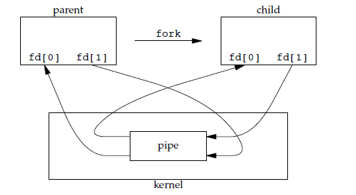

https://mp.weixin.qq.com/s/i0PmP86iVv_-TlN8MLWIsw

# 概述

## 基本特征

1. 并发

   并发指宏观上一段时间内同时运行多个程序，并行指同一时刻能运行多个指令。操作系统使用进程和线程的概念实现程序的并发运行

2. 共享

   共享指系统中的资源可以被多个并发进程使用，分为互斥共享（临界资源，使用同步机制实现互斥访问）和同时共享

3. 虚拟

   虚拟指把一个物理实体转换为多个逻辑实体，分为时分复用（进程轮流占用处理器）、空分复用

4. 异步

## 基本功能

1. 进程管理
2. 内存管理
3. 文件管理
4. 设备管理

# 进程管理

## 进程与线程

1. 进程

   进程是资源分配的基本单位

2. 线程

   线程是独立调度的基本单位，一个进程中可以有多个线程，共享进程资源

3. **进程与线程的区别**

   对于操作系统而言,进程偏重于内存资源管理,线程偏重于CPU调度

   - 拥有资源

     进程拥有资源，线程不拥有资源，但可以访问隶属于进程的资源

   - 调度

     线程是独立调度的基本单位，在同一进程中，线程的切换不会引起进程的切换，开销小速度快；从一个进程中的线程切换到另一个进程中的线程会引起进程切换

   - 系统开销

     创建或销毁进程时，操作系统需要为其分配或回收资源（内存空间、IO等），切换进程时，操作系统也需要将这些资源更新，开销较大；

     线程切换只需保存设置少量内容（**堆栈、少量寄存器、程序计数器PC**），开销很小。

   - 通信方面

     线程间通信可以通过读写同一进程中的数据，进程通信需要借助IPC

## 进程状态切换

- 就绪状态（Ready）：等待被调度
- 运行状态（running）
- 阻塞状态（waiting）：缺少某些必要的资源

## 进程调度

 ### 批处理系统-保证吞吐量和周转时间

1. 先来先服务（FCFS）
2. 短作业优先（SJF）
3. 最短剩余时间优先（SRTN）

### 交互式系统--快速响应

1. 时间片轮转
2. 优先级调度
3. 多级反馈队列

### 实时系统-截止时间前响应

## 线程同步的方法✨

临界区、互斥量主要用于互斥控制；信号量、事件对象主要用于同步控制

### 1. 临界区

通过对多线程的串行化来访问公共资源或一段代码，速度快，适合控制数据访问。在任何时刻只允许一个线程对共享资源访问，当一个线程访问后其他试图访问的线程被挂起，直到公共资源被释放

### 2. 互斥量Mutex

只有拥有互斥量的线程才有访问公共资源的权限。互斥量只有一个，当前拥有互斥量的线程处理完任务后必须将线程交出，以便其他线程访问该资源。

### 3. [信号量](https://chorer.github.io/2020/03/25/OS-%E6%93%8D%E4%BD%9C%E7%B3%BB%E7%BB%9F%E5%AD%A6%E4%B9%A0%E7%AC%94%E8%AE%B0-5%EF%BC%9A%E8%BF%9B%E7%A8%8B%E5%90%8C%E6%AD%A5%E4%B8%8E%E8%BF%9B%E7%A8%8B%E4%BA%92%E6%96%A5%EF%BC%88%E4%BA%8C%EF%BC%89%EF%BC%9A%E4%BF%A1%E5%8F%B7%E9%87%8F%E6%9C%BA%E5%88%B6/)

允许多个线程在同一时刻访问同一资源

### 4. 事件对象

通过通知操作的方式来保持线程的同步，还可以方便实现对多个线程的优先级比较的操作

## 进程通信的方法✨

- 进程同步:控制多个进程按一定顺序执行;
- 进程通信:进程间传输信息、资源共享、时间通    知、进程控制

个人认为同步与通信概念上没必要分的特别细，进程通信是一种手段，同步是一种目的．能够通信就是一定是一种同步机制．

### 1. 匿名管道

IPC最 基本的一种实现机制，基于字节流通信，本质上就是实现一个两进程都能访问的文件，若想要数据流从父进程流向子进程，则关闭父进程的读端（fd[0]）与子进程的写端（fd[1]）；

- 只能半双工通信(使用pipe函数创建,fd[0]用于读,fd[1]用于写);

- 只能在父子进程或兄弟进程中使用;

  

### 2. 命名管道(FIFO)

FIFO常用于C-S应用程序中，FIFO用作汇聚点在客户进程和服务器进程之间传递数据

- 任意进程间半双工通信，可以在父子进程中使用（使用mkfifo函数创建）

- 命名管道使用前需要使用open()打开，命名管道是设备文件存储在磁盘上，匿名管道是存在于内存中的特殊文件。

  命名管道使用open打开有可能会被阻塞：以读写方式打开一定不会阻塞；以只读方式打开，调用open()函数会被阻塞直到有数据可读；以只写方式打开，调用open函数会被阻塞直到以其他方式打开。

### 3. 消息队列

实现两进程间双向通信，克服了信号传递信息少、管道只能承载无格式字节流以及缓冲区大小受限等缺点。

- 可独立于读写进程存在
- 避免FIFO的同步阻塞问题，不需要进程自己提供同步方法
- 读消息时可以根据消息类型有选择性的接收消息，而不像FIFO只能默认接收

### 4. 信号量（semophore）

计数器，用于为多个进程提供对共享数据对象的访问。作为一种锁机制，防止某些进程正在访问共享资源时其他进程也访问。

### 5. 信号（signal）

进程间传递信号，捕获到信号后执行对应绑定的代码，可以实现进程通信的“单播”“广播”

### 6. 共享内存

允许多个进程共享一个给定的存储区，不需要在进程间复制数据，速度最快；

需要使用信号量进行访问的同步

### 7. Socket套接字

可用于网络上不同机器间的进程通信

# TODO：

经典同步问题：哲学家进餐、读者写者问题、生产者消费者问题

参考资料

[进程间通信（IPC）——匿名管道和命名管道](https://blog.csdn.net/weixin_39763552/article/details/80306734)

[进程同步和线程同步概述](https://cloud.tencent.com/developer/article/1129585)