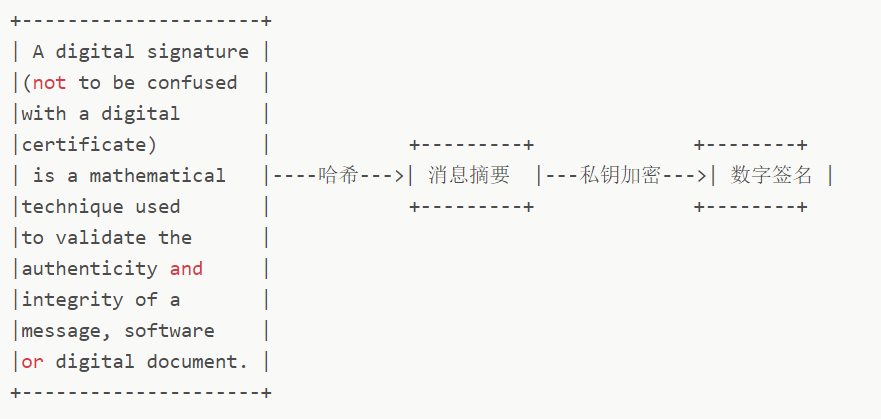
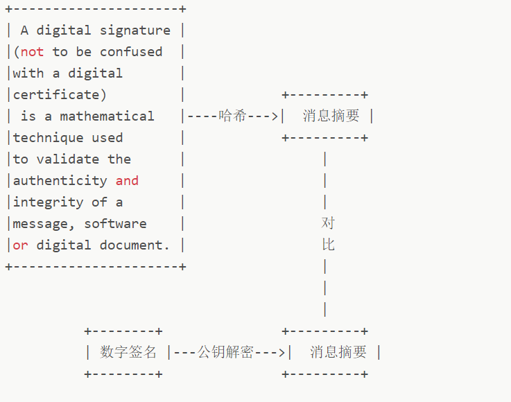

> 加密算法整体可以分为：可逆加密、不可逆加密
>
> 可逆加密又可以分为对称加密和非对称加密

## 一、可逆加密

### 1. 对称加密算法

对称加密算法，又称为共享密钥加密算法。在数据加密和解密时使用的是**同一个密钥**，这就导致密钥管理困难的问题。常见的对称加密算法有`DES`, `3DES`, `AES128`, `AES192`, `AES256`。其中`AES`后面的数字代表的是密钥长度。对称加密算法的安全性相对较低，比较适合内网环境中加解密。

#### 1.1 DES

DES加密算法是一种**分组密码**，以64位为分组对数据加密，它的密钥长度是56位，加解密用同一算法。

#### 1.2 3DES

基于DES的加密算法，3DES（即Triple DES）是`DES`向`AES`过渡的加密算法，它使用**3个不同的56位的密钥对一块数据进行三次加密**，强度更高。

#### 1.3 AES算法

`AES` 高级数据加密标准，能够有效抵御已知的针对`DES`算法的所有攻击，默认密钥长度为`128`位，还可以供选择`192`位，`256`位。这里顺便提一句这个位指的是bit。

### 2. 非对称加密算法

非对称加密算法，又称为公开密钥加密算法。这两个密钥完全不同但又完全匹配，只有使用匹配的一堆公钥和私钥，才能完成对明文的加密和解密过程。常见的非对称加密有`RSA`, `SM2` 等

- 非对称加密的特点是1 v n，服务器只需要一个私钥就能和多个客户端进行加密通信。而对称加密则需要针对每个客户端保存一个密钥。

#### 2.1 RSA

`RSA` **加密算法** 基于一个十分简单的数论事实：将两个大 **素数** 相乘十分容易，但想要对其乘积进行 **因式分解** 却极其困难，因此可以将 **乘积** 公开作为 **加密密钥**。

#### 2.2 ECC算法

`ECC` 也是一种 **非对称加密算法**，主要优势是在某些情况下，它比其他的方法使用 **更小的密钥**，比如 `RSA` **加密算法**，提供 **相当的或更高等级** 的安全级别。不过一个缺点是 **加密和解密操作** 的实现比其他机制 **时间长** (相比 `RSA` 算法，该算法对 `CPU` 消耗严重)。

## 二、不可逆加密

常见的不可逆加密算法有`MD5`, `HMAC`, `SHA-1`, `SHA-224`, `SHA-256`, `SHA-384`, 和`SHA-512`, 其中`SHA-224`、`SHA-256`、`SHA-384`，和`SHA-512`我们可以统称为`SHA2`加密算法，`SHA`加密算法的安全性要比`MD5`更高，而`SHA2`加密算法比`SHA1`的要高。其中`SHA`后面的数字表示的是加密后的字符串长度，`SHA1`默认会产生一个`160`位的信息摘要。

#### 1. MD5

> MD5信息摘要算法（Message-Digest Algorithm），一种被广泛使用的密码散列函数，可以产生出一个128位（16字节）的散列值（hash value），用于确保信息传输完整一致。本质上，其就是一种哈希函数，用于对一段信息产生摘要，以**防止被篡改**。

`MD5` 算法有以下特点：

1. 压缩性：无论数据长度是多少，计算出的`MD5`值长度相同，均为128位
2. 容易计算性：由原数据可以很快计算出`MD5`值
3. 抗修改性：即使修改一个字节，计算出的`MD5`值也会产生巨大差异
4. 抗碰撞性：知道数据和`MD5`值很难找到相同`MD5`的原数据

#### 2. SHA系列

`SHA1` 是和 `MD5` 一样流行的 **消息摘要算法**，然而 `SHA1` 比 `MD5` 的 **安全性更强**。对于长度小于 `2 ^ 64` 位的消息，`SHA1` 会产生一个 `160` 位的 **消息摘要**。基于 `MD5`、`SHA1` 的信息摘要特性以及 **不可逆** (一般而言)，可以被应用在检查 **文件完整性** 以及 **数字签名** 等场景。

#### 3. HMAC

- `HMAC` 是密钥相关的 **哈希运算消息认证码**（Hash-based Message Authentication Code），`HMAC` 运算利用 **哈希算法** (`MD5`、`SHA1` 等)，以 **一个密钥** 和 **一个消息** 为输入，生成一个 **消息摘要** 作为 **输出**。

- 发送方和接收方都有密钥来进行计算，没有密钥**无法计算**出正确的散列值，`HMAC`算法更像是一种加密算法，它引入了密钥，其安全性已经不完全依赖于所使用的Hash算法

## 三、HTTPS使用的加密算法

### 1. HTTPS的工作流程

1. 客户端发起一个https的请求
2. 服务器把之前配置好的**公钥证书**返回给客户端
3. 客户端验证**公钥证书**：有效期、用途与请求站点相匹配、是否在CRL吊销列表中、上一级证书是否有效...验证通过则继续否则显示警告信息。
4. 客户端使用伪随机数生成器生成加密所使用的**会话密钥【对称加密AES】**，用**证书的公钥【非对称加密RSA】**加密这个**会话密钥**，发送给服务器
5. 服务器使用**私钥【非对称加密RSA】**解密消息，得到**会话密钥**，至此，通信双方都持有相同的**会话密钥**
6. 服务器使用**会话密钥**加密**"明文内容A"**，发送给客户端
7. 客户端使用**会话密钥**解密相应的密文，得到**"明文内容A"**。
8. 客户端再次发起HTTPS的请求，使用会话密钥加密请求的**"明文内容B"**，然后服务器使用会话密钥解密密文，得到**"明文内容B"**

### 2. HTTPS解决的三个问题

#### 2.1 解决内容被窃听---加密

**方法：对称+非对称加密**

将HTTPS工作过程简化一下：

1. A生成了一个随机AES口令，用B的公钥通过RSA加密发给B
2. B用自己的RSA私钥解密得到AES口令
3. 双方使用相同的AES口令进行加密通信

#### 2.2 解决报文被篡改---数字签名

1. 验证发送者身份
2. 确定消息完整性

**生成数字签名：**

将一段文本先用Hash函数生成消息摘要，然后用发送者的私钥加密生成数字签名，与原文一起传送给接收者。

**校验数字签名：**

接收者只有用发送者的公钥才能解密被加密的摘要信息，然后用HASH函数对收到的**全部信息**产生一个摘要信息，**将自己计算得到的摘要信息与收到的摘要信息对比**。如果相同，则说明收到的信息是完整的，在传输过程中没有被修改，否则说明信息被修改过，因此数字签名能够验证信息的完整性。

但是，以上过程要求接收者已知发送方的公钥，但公钥是不能在不安全的网络中直接发送给接收方的，此时就需要引入**证书颁发机构CA**，CA对发送方的公钥数字签名后生成证书，**确保公钥没有被篡改**。

#### 2.3 解决通信方身份认证---数字证书

数字证书认证机构处于客户端与服务器双方都可信赖的第三方机构的立场上。

**证书使用流程：**

1. 客户端 Client 向服务器 Server 发出请求时，Server 返回证书文件; 
2. 客户端 Client 读取证书中的相关的明文信息，采用相同的散列函数计算得到信息摘要，然后，利用对应 CA的公钥解密签名数据，对比证书的信息摘要，如果一致，则可以确认证书的合法性，即服务器的公开密钥是值得信赖的。

参考资料：

https://mp.weixin.qq.com/s/qSQJ04WV4ECIc-cUNeek9g

https://juejin.cn/post/6844903638117122056#heading-10

https://cattail.me/tech/2015/11/30/how-https-works.html